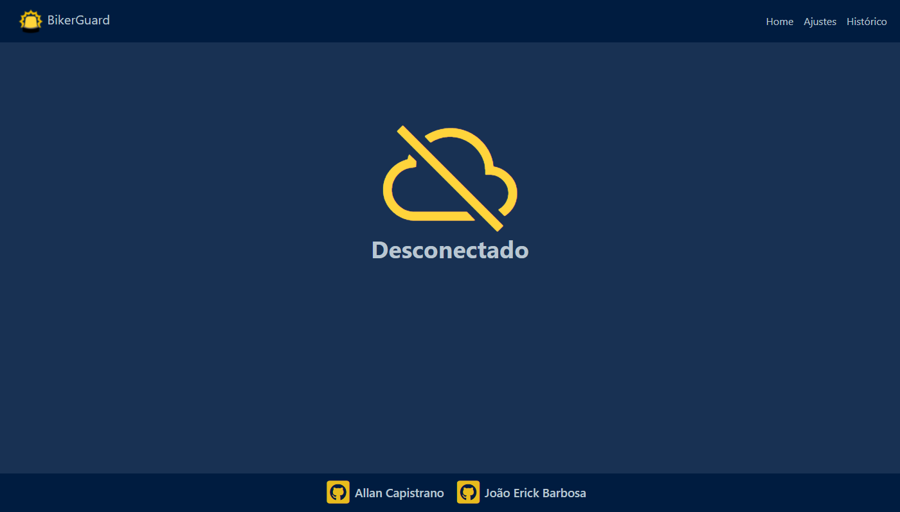
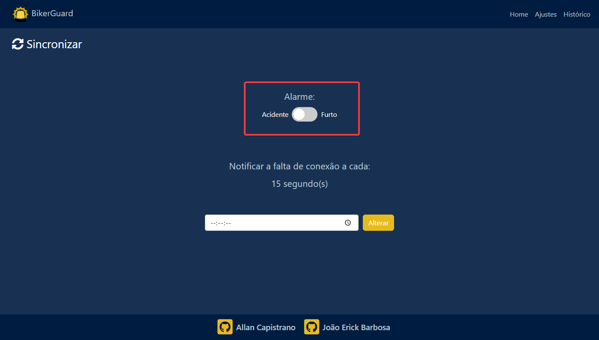
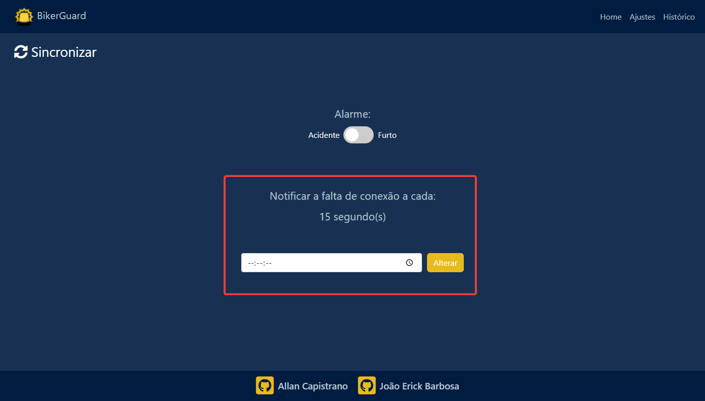
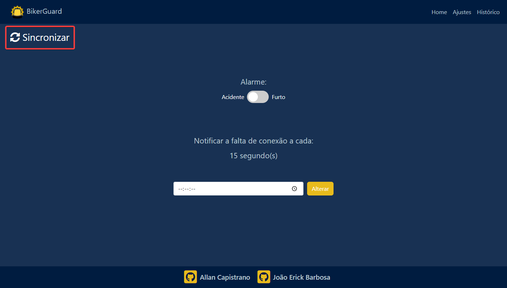
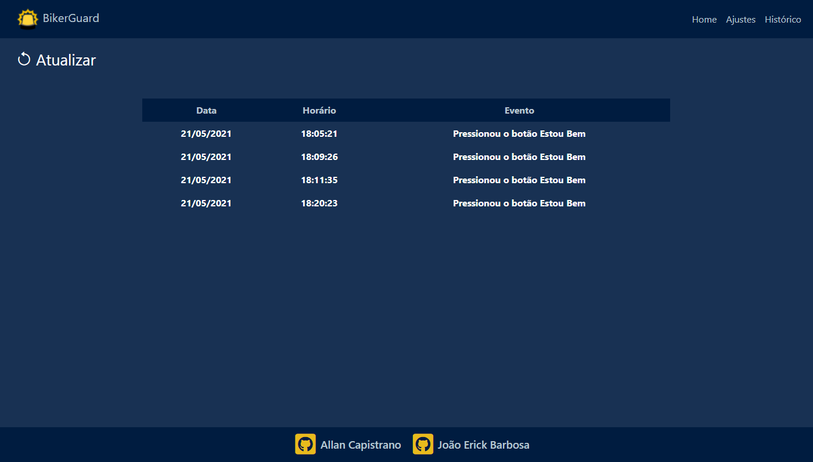
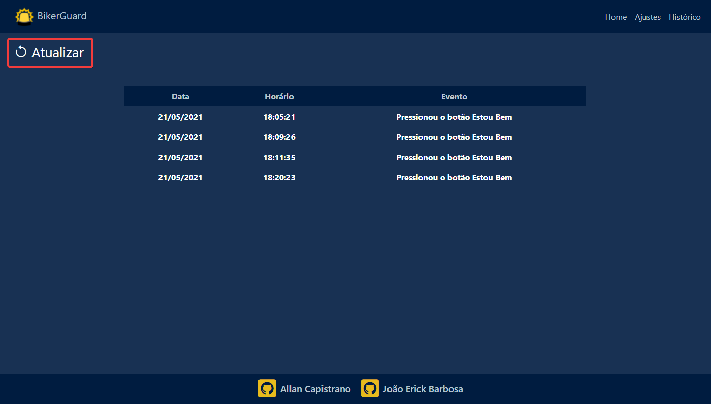

# Manual de Usuário

- [Página Inicial](#página-inicial)
- [Página de Ajustes](#página-de-ajustes)
- [Página de Histórico](#página-de-histórico)

## Link da aplicação Web
### [BikerGuard](http://bikerguard-env.eba-32kbmghs.us-east-1.elasticbeanstalk.com/)

---

## [Página Inicial](http://bikerguard-env.eba-32kbmghs.us-east-1.elasticbeanstalk.com/)

### Estado da conexão
Esta página indica o estado atual da conexão do dispositivo, atualizando automaticamente a cada metade do tempo definido para o intervalo

  

---

## [Página de Ajustes](http://bikerguard-env.eba-32kbmghs.us-east-1.elasticbeanstalk.com/settings)

### Definir Modo do Alarme
Por meio desse switch, é possível alterar o modo do alarme (Esquerda ➞ Acidente | Direita ➞ Furto).

  

---

### Definir o intervalo para verificação de conexão
Nessa seção é exibido o valor do intervalo atual. 

Além de que é possível alterar esse valor por meio do campo abaixo, após a alteração do valor, basta clicar em **Salvar**.

  

---

### Sincronizar os ajustes
Caso necessário, é possível sincronizar os ajustes (modo do alarme, intervalo de verificação de conexão) através do botão **🔄 Sincronizar** presente no 
canto superior esquerdo.

  

---

## [Página de Histórico](http://bikerguard-env.eba-32kbmghs.us-east-1.elasticbeanstalk.com/historic)

### Tabela de Histórico
Nesta página são exibidos os eventos que ocorreram durante as últimas 24 horas.

  

---

### Atualizar Histórico
Sempre que quiser saber as informações mais recentes, clique no botão **⟲ Atualizar** para atualizar a tabela do histórico.

  

